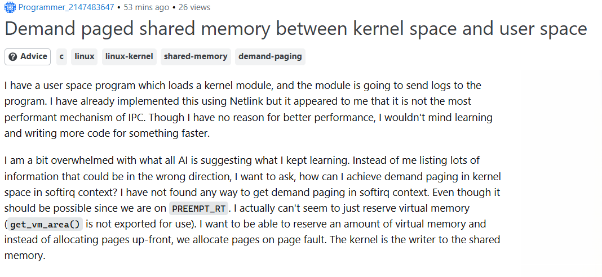

*“There are naive questions, tedious questions, ill-phrased questions, questions put after inadequate self-criticism. But every question is a cry to understand the world. There is no such thing as a dumb question.”
― Carl Sagan*

## Introduction: The importance of asking questions

No one goes through life having never asked a single question. When I was young, I would ask my parents tons of questions. Ranging from, "Could a pirate beat a cowboy in a fight?" to, "Why is the sky blue?" Asking questions is how we learn about the world around us and make sense about things we don't yet understand. 

As we grow older, however, those questions become more complex, and the way we ask them becomes just as important as the answers themselves. This is especially true in software engineering, where problem solving often requires seeking help from others. However, in his essay /How to Ask Questions the Smart Way,/ Eric Raymond explains that asking clear, thoughtful, and well-researched questions is a critical skill for developers. Rather than immediately turning to others for help, Raymond emphasizes the importance of first attempting to solve the problem independently. By researching the issue, testing possible solutions, and gathering relevant information beforehand, developers can ask more effective questions and are more likely to receive useful answers in return.

## An example of a smart question


Image source: [Demand paged shared memory between kernel space and user space](https://stackoverflow.com/questions/79954383/demand-paged-shared-memory-between-kernel-space-and-user-space)

A strong example of a "smart" question can be found in this post about implementing demand paged shared memory between kernel and user space in Linux. In their post, the developer, clearly explains the context of their situation, including that they are working with a user-space program and a kernel module and using Netlink. They also describe what they have already tried and why they are exploring different methods. This shows that this developer had already tried troubleshooting beforehand but keep running into problems. Most importantly, the question is specific and technically detailed, focusing on a precise issue rather than asking for general advice.

This aligns with Eric Raymond's guidelinesbecause the user demonstrates effort, provides relevant context, and clearly defines the problem they need help solving. As a result the question is structured in a way that allows others to answer as effectively as possible. 

## An example of a not so smart question

```
Hello!
I need help creating an app for a school project.
I have a limited background in coding, and I have no idea where to begin.
Please help!
```

My example above, has several glaring issues that make it not an effective way of asking a question. First of all, other than it being for a "school project" there is no other context given. Details such as; what the app is, what coding language is needed, and what is needed for the app. Another huge problem is that the question is asking for general help with creating the app. Instead of asking smaller more detailed questions to get more precise answers. 

Finally, the developer admited that they do not have a huge knowledge of coding, while this is not necessarily an issue, what is a problem is when a developer, doesn't take the time to do prior research or put in the leg work to solve their issues. Instead they just want someone to help them write the code for the app for them, without putting in much effort. That is NOT how you ask a smart question, that's just asking a question to be lazy.

## Conclusion

In conclusion, while asking questions is definitely an important part of the software development process, the way we ask questions is just as important. For you to get the most benefit from asking a question, you must provide as much relevant context as possible, have attempted to troubleshoot by yourself first, as well as making sure your questions are not vague, open ended questions. That way, you can display that, you have attempted to work things out by yourself, but that some guidance is till apreciated. 

## Disclaimer

I used AI to help polish my writing and help tighten my arguments. However, the main points, the "not so smart" example used, and analysis are entirely my own.

