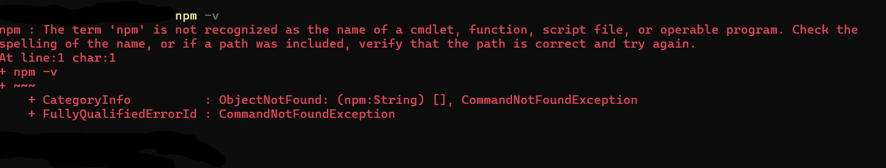

*"If at first you don't succeed, try, try, try again" - William Edward Hickson*

## Introduction: My first impression of coding standards

Before now, I never paid any attention to coding standards. I didn't even know what they entailed. I used to think that coding standards were mostly about formatting decisions and were pretty much optional. So when this week's coding lesson began, I thought this would be as straight forward as the previous week's lessons.

Boy was I wrong.

## Trials and Tribulations

The beginning of the week did not go exactly as I had planned. Instead of immediately using coding standards and learning how to improve my coding skills, I was stuck at the very first instructional video. 

No matter what I did or tried, I could NOT get NVM installed on my computer. 

At first it was frustrating because I wasn't even at the actual meat of the assignments and I was already having trouble. I felt like I was missing out on critical lessons and unable to even get started. Everyone else seemed to be having no trouble with getting ESLint working, while I couldn't even get my program working correctly. I spent almost all of this week trouble shooting, downloading and redownloading NVM, Googling solutiions, and even going to Copilot for help. Unfortunately, no matter what I did nothing worked.

## Lessons I learned along the way

Before now, I used to think that software engineering mostly dealt with opening up a code editor and writing code. This week changed all that.

Even though I did not get as much hands on experience with ESLint as I wanted, I started to realize that coding standards depend on more than just coding or self discupline. Coding standards only work when teams have the tools to actually enforce these coding standards. If everyone's systems are different or programs are installed incorrectly, maintaining consistant code becomes nearly impossible.

I also realized that software development is much more complex than I had originally thought. It's much more than just writing syntax and making sure websites look and opperate correctly. There is an entire layer of tooling and that goes hand in hand with the development process. Initial set ups, configuration files and package managers. Those parts, while not very exciting, make the excecution of coding standards even possible.

## Conclusion

ALthough, I was unable to learn the intended lessons of this week. I feel like I have gained a much better appreciation for web and softwaare development. Coding standards are not only about making code look cleaner. They are connected to the larger development process that helps programmers write and maintain consistant software that everyone can use and access.

I am still working towards fixing my program and working with ESLint. However, this experience changed my view of software development and the tribulations that can arise in the world of software engineering. Sometimes the best lesson is not the assigned lesson itself, but the lessons you learn when you reach a dead end.

## Disclaimer

I used Copilot to help tighten my arguments and some minor grammar corrections. Everything else was all me.

