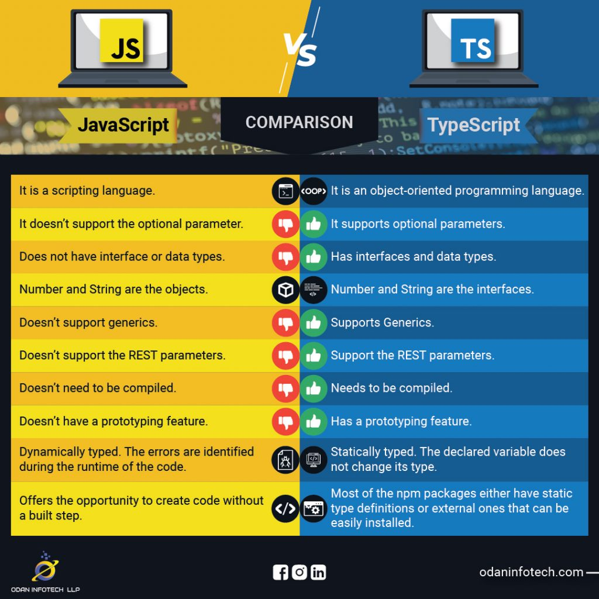

*“Anyone who keeps learning stays young.” – Henry Ford*

## Preface: My Personal History of Coding

My prior experience with coding is pretty limited. In my previous ICS classes, I have worked with various C, C++, Java and a bit of Javascript. I wouldn't say that I'm fully confident in any of these languages, but I do feel comfortable with the basic consepts: variables, functions, classes, and even some loop functions. When I started working with TypeScript, I immediately noticed both familiar patterns as well as a few differences. Some of these similarities made the transition smoother, while the differences made my first few attempts feel clumsy. Still, the learning curve has been interesting, especially when comparing TypeScript to my past coding knowledge.

## Similarities

Let's start with some similarities. When first going into TypeScript, I was surprised by how similar much of the language felt. Which shouldn't be surprising since TypeScript is a subset of JavaScript. As I was working, I recognized a lot of the commands that I had used in my past experience. Commands such as; number, string, and boolean. This gave me a sence of familiarity that would be the structure of my TypeScript journey. 

TypeScript’s class syntax also made the transition easier. Concepts like constructors, inheritance, and access modifiers were things I was already used to, so reading and writing TypeScript classes didn’t feel like starting from square one. For example:

*Class in TypeScript*
```
class Student {
  name: string;
  constructor(name: string) {
    this.name = name;
  }
}
```

*Class in Java*
```
class Student {
  String name;
  Student(String name) {
    this.name = name;
  }
}
```

The same was true for functions. Writing a function with typed parameters and a typed return value felt almost identical to writing a method in C++ or Java. These similarities helped me get comfortable with the language faster than I expected.

## Differences


## Conclusion


